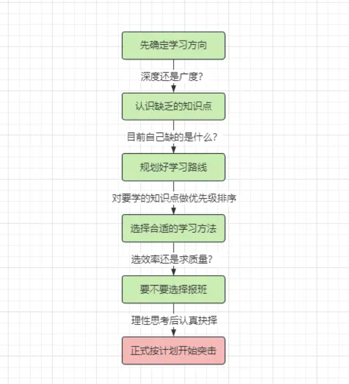

## 技术突击篇

> 根据求职意向进行高效的提升和复盘

- **围绕着期望薪资准备面试，不要闭眼摸虾！**
- **从JD 中选取出现频率较高的技术栈和要求，进行定制化复盘。**

### 技术突击：时间充裕的骑驴找马者

如果时间充裕应该去追求广度还是深度？既然是做技术突击，**如果想要找"中级水平"的工作，首先应该追求广度，如果尝试"高级开发"的面试,应该追求深入.**

==广度不是覆盖全部，深度不是死钻到底==

### 最快与最有质量的学习方法

- 效率最高的学习方法：读经典书籍，看优质专栏。(**我应该注重的，多看源码**)
- 质量最高的学习方法：看教学视频，跟培训课程。

不过有一点不可否认:**通过第二种方式学习，无疑会比前者更加轻松且质量更高**

**通过看视频/课程的方式学习，容易让人产生依赖性，丧失一定程度上的自主学习能力！**

### 刷面试题的最好的方式

1. ==看八股文时一定要学会自己去理解==
2. **不要拿着一份相同的八股文反复看！**
3. 刷题方式：
   1. 第一遍以理解思维去看：能让你对相应知识点形成自己的认知。
   2. 后续针对相同技术多刷不同面试题：能纠正你前面的错误认知，增强你对知识点的记忆。
   3. 最后模拟回答再看解析：能联想面试场景回答，再次加深脑海里的印象。

## 简历优化篇

结合知识图谱画像，去写一份自己的简历，**不要去照搬别人的简历，每个人的技术掌握度，经历都有所差异。**

